# Prepare your SD card for use as HardDrive on Emu68

## Foreword

Emu68 is a bare metal JIT translator of m68k binaries which attempts to emulate as little as possible. Therefore, you will not find a way to attach a HDF image file to the system and let Emu68 pretend that this is a hard drive. No. Instead, Emu68 in PiStorm (and native AROS) variant has added a Zorro III card with a ROM containing device driver for microSD interface of Raspberry Pi.

The microSD card can be used as a hard drive on your system without any further actions required from your side. However, such solution is potentially dangerous - you have **full access** to the card and you can do any harm you like to it, including modifying and/or destroying boot files and Emu68 image itself. But there is a safer way of doing things. Instead of using disk as a whole, you can define primary partitions of type ``0x76`` which will appear as separate hard drive units on your m68k operating system. Do anything with them and your boot partition will stay safe. You can even move them on the microSD card, or copy them using a ``dd`` tool to other cards or to a hardfile.

In this document I will guide you step by step from a freshly bought microSD card to an AmigaOS installed on it. This guide assumes that you have access to a Windows machine, but nearly the same steps can be performed on Linux or macOS. Also, keep in mind that the card has to use MBR partition layout. GPT is not yet supported by the SDHC driver of Emu68.

## First steps

First open the Computer Management tool on windows and proceed to the Disk Management. There, you need to identify the microSD card which, I assume, is already inserted into the card reader. In the case shown below the microSD is visible as ``Disk 1``.


Now, delete the volume (E: in my case) from the card as we do not need it anymore. Subsequently create a new simple volume (that will be a primary partition) there

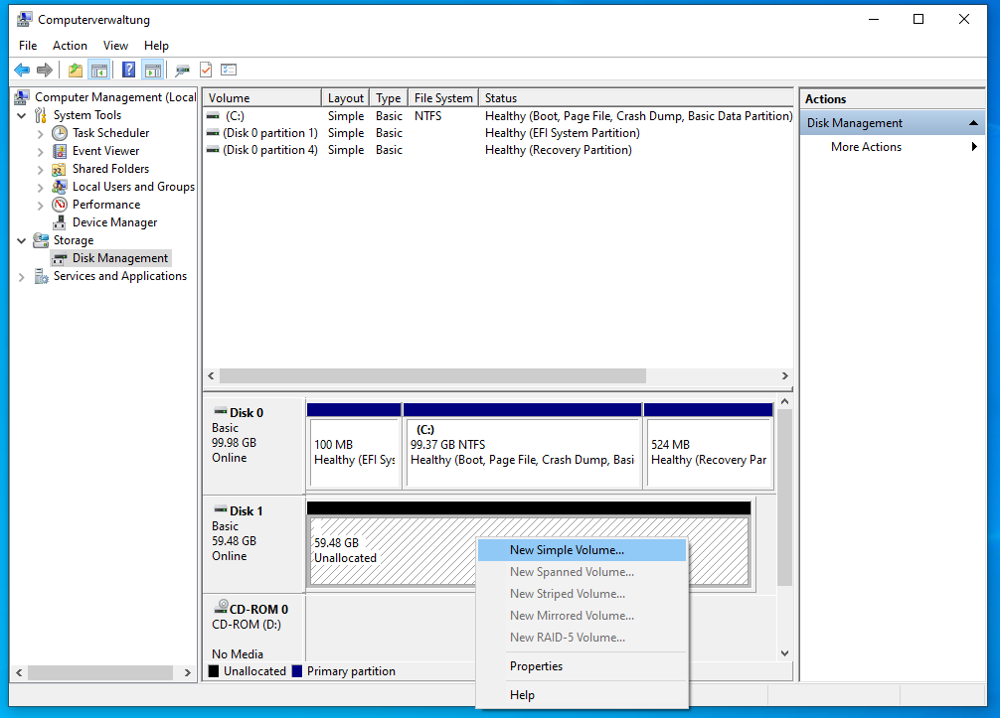

A new dialog will appear asking you several questions. First one is about the size of the volume. Set it to some small value, let's say 200 MB which ought be enough for everyone ;) Let Windows format it as FAT32 and assign a drive letter to it as we will copy the Emu68 files there in a while. Give this volume any name of your choice and complete the process. Now you have your boot partition.

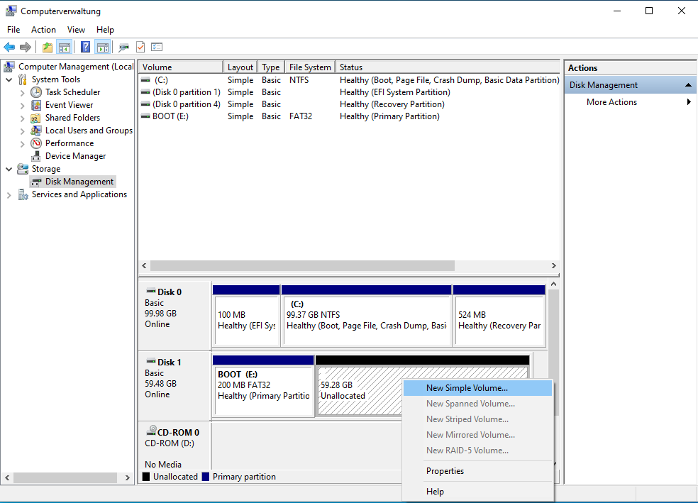

Now, we will use the remaining space as a virtual drive for Emu68. In order to do that create a new simple volume there.   In the dialog window **do not** assign a letter to that volume, otherwise Windows will prompt you to format it later. Please select that windows shall not format the volume and finish dialog. Now you should have something like this, with our special partition marked as ``RAW``:

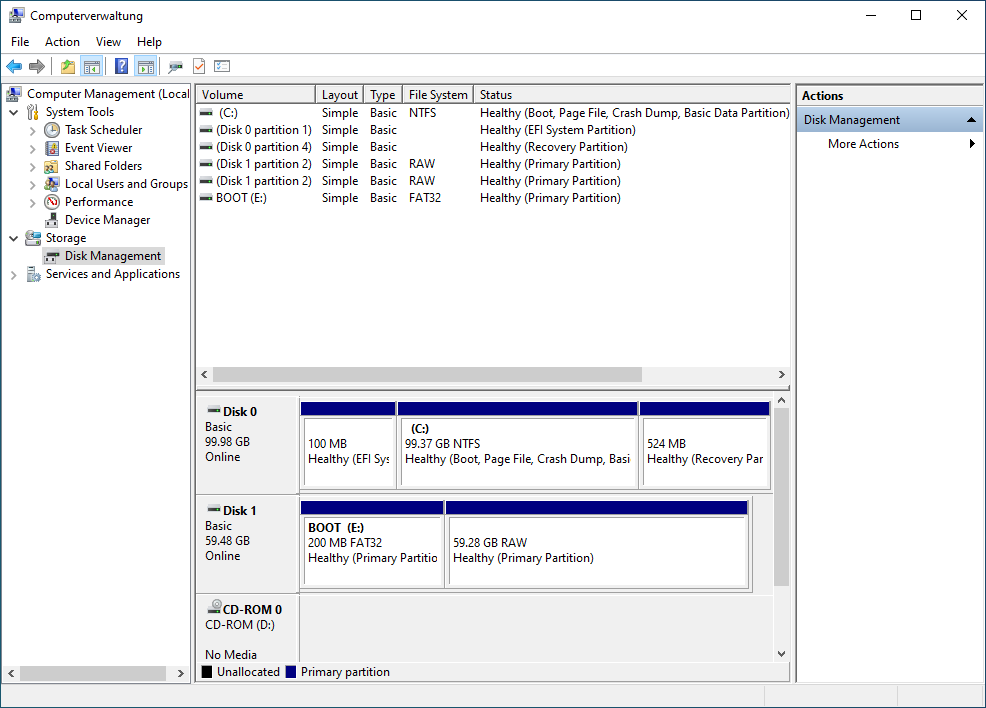

## Dangerous part

Now fasten your seat belts. If you are unfamiliar with Windows or you will do any mistake here, you may just render your windows not bootable. What we need to do is to change the partition type for the newly created RAW volume. It will be changed to a type ``0x76`` which is an information for Emu68 (and WinUAE or Amithlon) that this is a virtual hard drive.

First, open command prompt as Administrator


There, start the ``diskpart`` tool - the allmighty disk partitioner

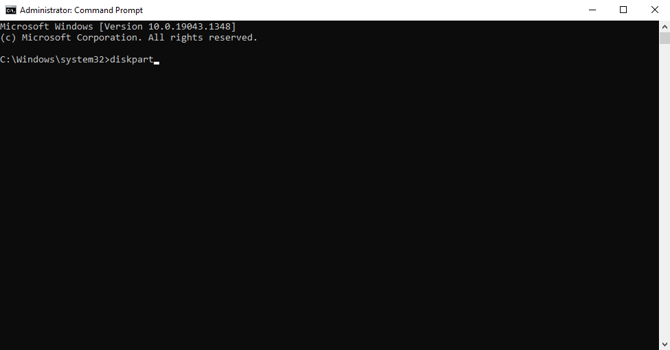

You may remember from Computer Management, that my microSD card was called ``Disk 1`` there. Now, let's make sure ``diskpart`` agrees on that and just list available disks


Here you go! Disk 1 is online, the size matches. Now, diskpart is a focus based tool. When you start it, it does not focus on anything. We need to put its focus on our microSD card so that we can continue. It will be done using ``select`` command. Type

```
select disk 1
```

and press ENTER. Now diskpart has its focus on microSD card. We need to repeat that step with putting diskpart focus on the partition. Use ``list`` command again, this time to display all partitions of selected disk

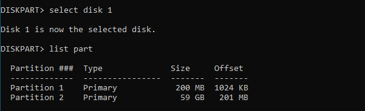

As you might guess by now, the partition 2 is the one which should be changed now. It will be done with command ``set`` as following

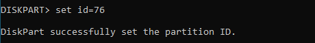

Done! Now you know why this tool is so dangerous. It assumes that you really know what you are doing and it will apply the changes without asking for any confirmation! So, be warned and make sure you really know what you are doing.

Ok, I hope you have selected correct disk and correct partition. The dangerous part is over, diskpart can be left. Type ``exit`` and press ENTER. Close the command line as it will not be needed anymore.

## Copying Emu68 files

In order to bring Emu68 to life, the boot partition needs to be populated with Emu68 and RasPi files. Please go to the Emu68 releases page on github (you can find it here: https://github.com/michalsc/Emu68/releases/tag/nightly) and locate most recent ``Emu68-pistorm`` file. Download it and open. Copy (per drag and drop for example) contents of the archive onto the FAT32 partition of the microSD card

 

If you are using a maprom-feature of Emu68, which I strongly advise, it is the right time to put your rom file onto the FAT32 partition and add a corresponding entry to the config.txt file. In my case I have just added the line

```
initramfs kick.rom
```

at the end of the document. Save the config and safely remove the card. Put it into Raspberry Pi. Now, the fun begins.

## Partitioning on AmigaOS

Power your Amiga with Pistorm and freshly prepared SD card on. It should boot immediately and you should see a kickstart boot screen asking you to insert a floppy. Proceed as usually when preparing new hard drive. In my case I have just started Amiga from Install disk of AmigaOs.

Once Workbench pops up you will notice that you do not see your hard drive yet. This is normal. We will prepare it using HDToolBox, so locate it. Before opening the tool, it will be necessary to adjust the tool types, because by default it attempts to work with scsi.device. So, let's edit it a little

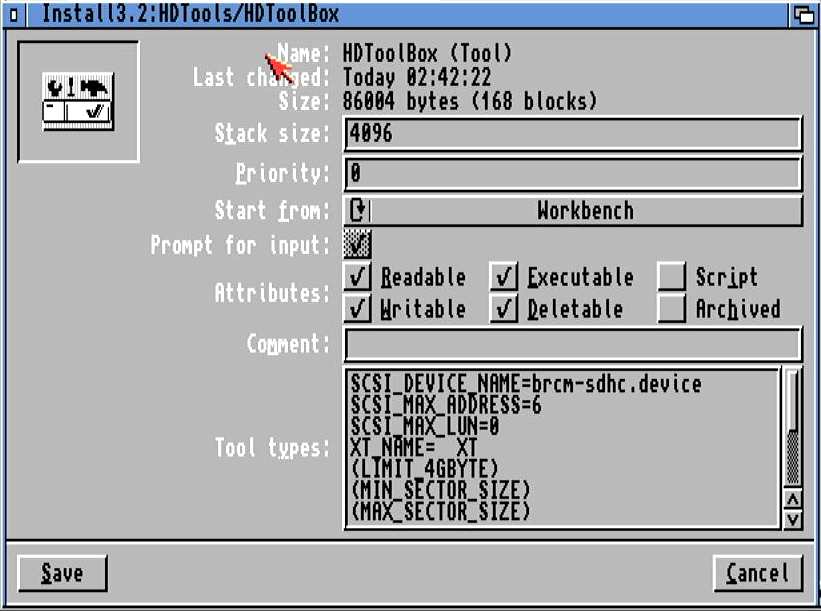

As you may see I have changed the ``SCSI_DEVICE_NAME`` so that it points to Emu68 SDHC driver, named ``brcm-sdhc.device``. If you want to reduce startup time of HDToolBox, consider reducing ``SCSI_MAX_LUN`` to ``0``, as the device driver is not using logical units. Now you may start HDToolBox. It should successfully report two unknown SCSI hard drives at addresses 0 and 1. You have to change the drive type before partitioning can begin, so let's do it.

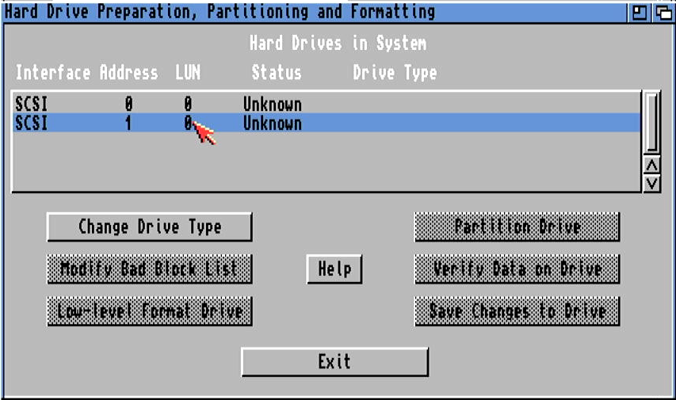

### Important!

Please **do not** change drive type of **address 0**. Device at this address is your whole microSD card, including the FAT32 boot partition. This device is there for advanced users only, who e.g. build a hybrid MBR/RDB device layout and/or for those who would like to view and modify contents of the boot partition. Once again, **do not** change this drive type, unless you really know what you are doing.

So, let's select drive at address 1 and click ``Change Drive Type``. A new rather empty window will pop up. Just click there ``Define New...`` button. In subsequent window you will finally be able to read configuration of the card. Do it, look at it and press ``Ok``.

 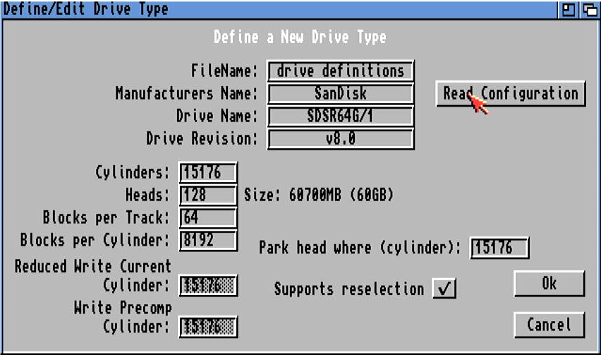

Now you can continue with partitioning of your drive and adding any special filesystems if you like. Put partitions as you like, set the buffers to somehow larger value - we have plenty of RAM so why not use it for something. Now, if you want to add there a new filesystem like I did, press ``Add/Update...``  button.

 

In subsequent window you will have option to add new filesystems to the drive. They will be embedded in RDB, so you will be able to boot from them. Press ``Add New FIlesystem`` button, select the file (or type it if file select requester is not available for some reason). I have decided to use PFS3aio which I have copied to RAM: previously.


In subsequent requester I have entered the DosType of ``0x50465303`` and confirmed everything by pressing OK. Now, PFS3 has been added and I was able to select it for partitions I've created.

If you are working with PFS3 you need to remember to adjust the Mask field accordingly. The default one suggested by HDToolBox was in my case ``0xffffff`` which tells filesystem that it's buffer should reside within first 16 megabytes. However, most of Emu68 RAM is beyond that area and PFS3 refuses to work, as it cannot allocate RAM satisfying the mask; the RAM above 16MB is added later, so it will be the first to be allocated for PUBLIC memory type.


Now, after creating all partitions, selecting filesystems, making them bootable etc, you are ready to write all changes to the drive. HDToolBox will tell you that a reboot is required to make the changes active. It is really so, therefore just agree on that.

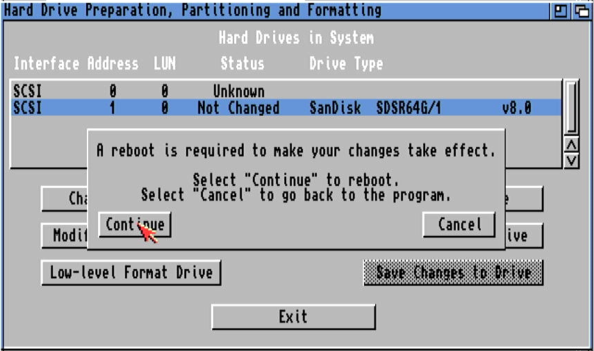

Upon next boot you will see your unformatted drives on Workbench screen.

 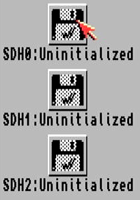

Just format them as you always do. Once done with that, proceed with installation of AmigaOS.

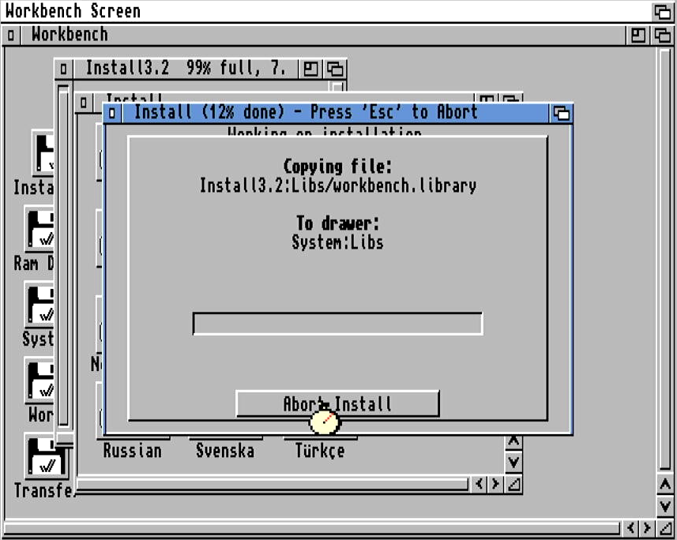

And voila! There you are! I wish you happy using of your microSD card with Emu68 :)

