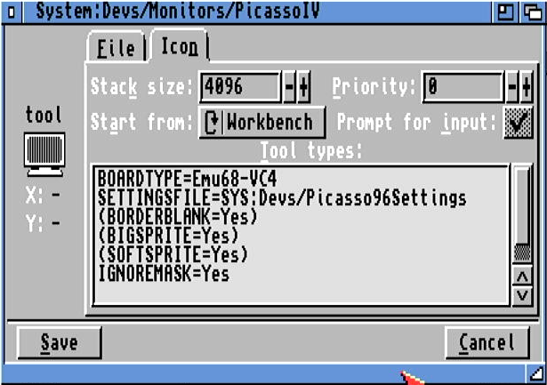
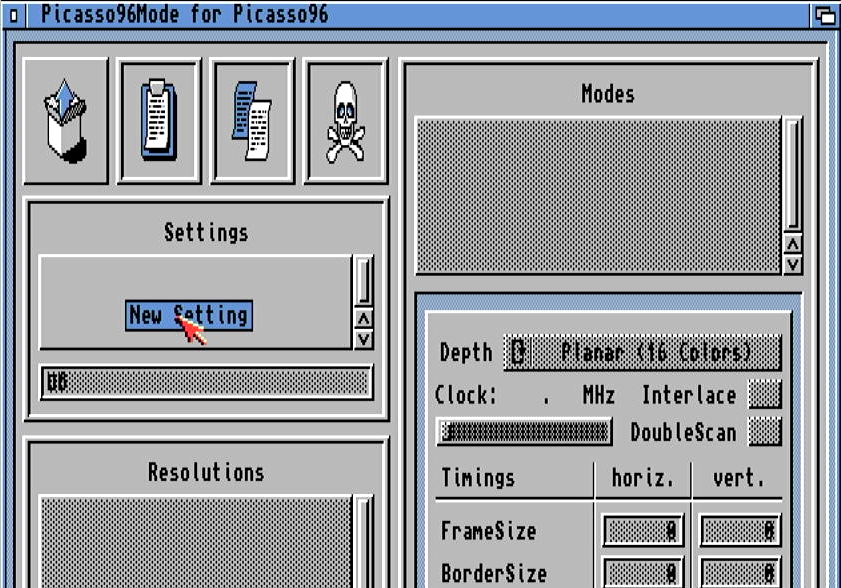
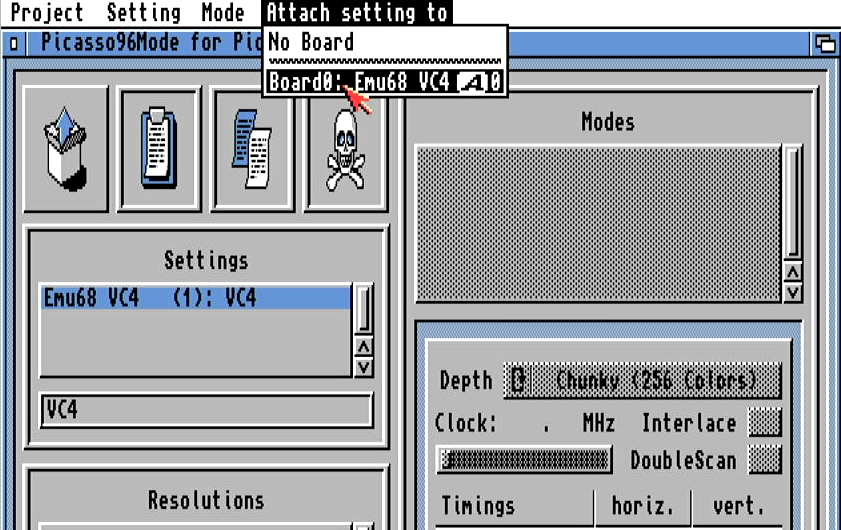
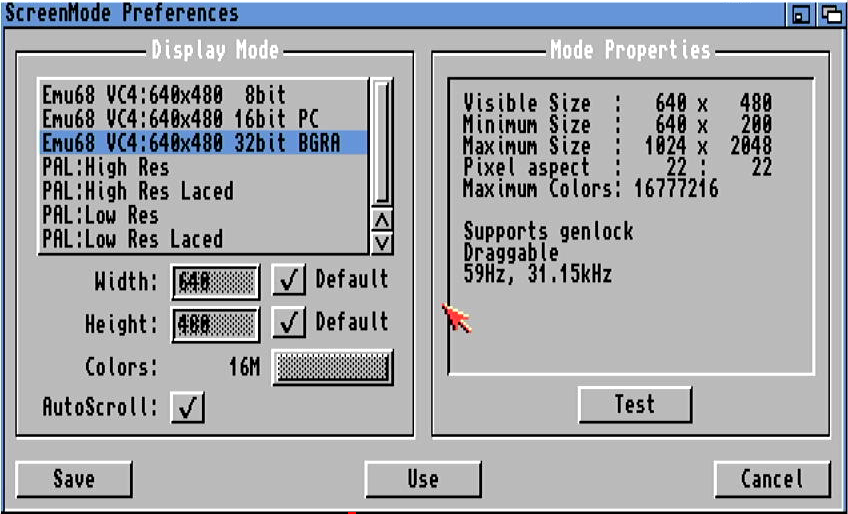
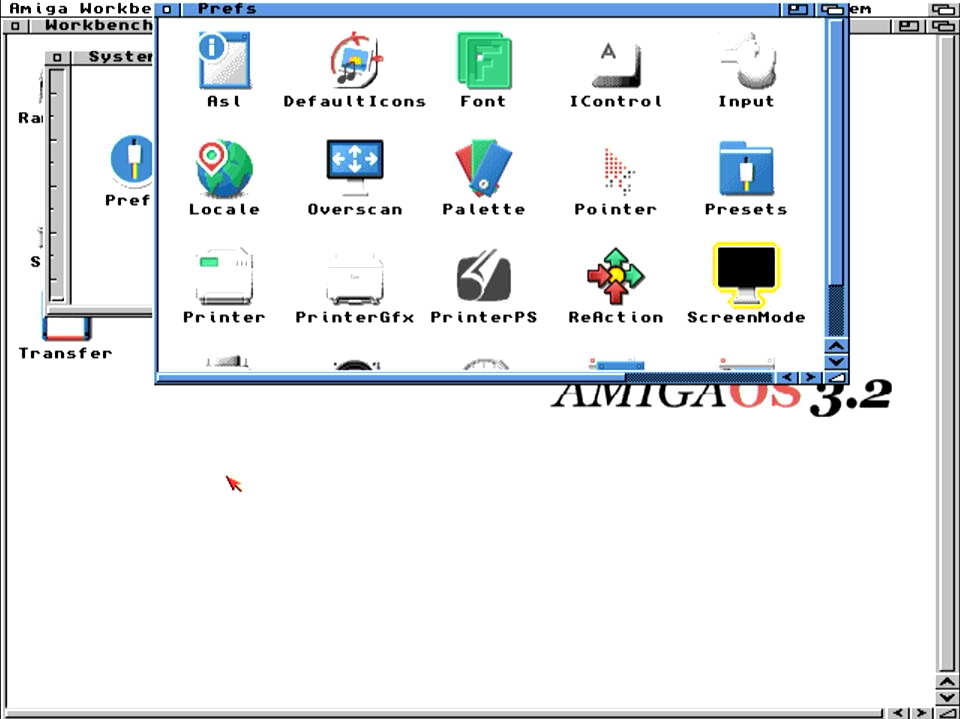

# Setting up Picasso96 with Emu68

In this short tutorial I will try go guide you with installation of Picasso96 (P96) subsystem on Emu68 with PiStorm. The guide works on systems with a bit of software installed already as well as with freshly installed ones.

### Important!

The emu68-vc4.card driver does not reconfigure the HDMI port. The port configuration is done only once, during startup of the VPU processor. Therefore, if you want to use Emu68 RTG feature, please make sure that you have some sort of sink (monitor, framegrabber, active splitter etc...) attached to HDMI port when powering on your Amiga.

First of all, you need to get a copy of P96. You can find older version on Aminet, but if you prefer a more recent one with several bug fixes and improvemends, go to the iComp website and obtain it there. Subsequently, prepare an ADF image (for example on WinUAE) where you will put

1. P96 archive: [AmiNet version](https://aminet.net/package/driver/video/Picasso96)
2. emu68-vc4.card file: [You can find it here](https://drive.google.com/file/d/1sQilE-bh7nW0bzgho6mDR2LdNPoc41wj/view?usp=sharing)
3. Lha if you don't have it yet: [Get from Aminet](https://aminet.net/package/util/arc/lha)


Boot Emu68 and copy the contents of your floppy to RAM. Once you did it, you can safely remove the floppy from the drive as it will not be necessary anymore. Now, start a new CLI window. If you don't have LhA installed on your system yet, execute the ``lha.run`` file. If will unpack few versions of LhA executable. Copy the one you prefer to your C: and name it just ``LhA``. Now you can unpack ``Picasso96.lha`` archive by typing

```shell
lha x Picasso96.lha
```


Once installer is decompressed, you may start the installation process now. It is important to select **at least one** graphics card to install. If you don't P96 installer will not create the necessary file in DEVS:Monitors. In my case I have selected PicassoIV, but any card should be just fine.


Complete the installation of P96 now, but **do not restart** your machine yet. Instead, copy the emu68-vc4.card to picasso96 location in libs

```shell
copy RAM:emu68-vc4.card LIBS:Picasso96/
```

Go to a ``Devs/Monitors`` location on your Workbench partition. You will find there the PicassoIV icon. Either leave it with that name if you don't care, or rename it to something like ``Emu68-VC4``. This is just cosmetics so not really important. Now, open the ``Information`` about that icon and go to the tool types. Locate the entry ``BOARDTYPE``  and change it to ``Emu68-VC4``. Save the changes.



Now it is the right moment to reboot your machine. So far nothing will change yet, you will just go to the workbench on a regular PAL (or NTSC) screen. Go to your Prefs folder on Workbench partition and open Picasso96Mode. It is rather empty so it has to be populated now. First, create new setting by dragging "New Item" icon to Settings area of the window. Drop it there



Give this setting a name, keep it short. Something like ``VC4`` should be just fine. Now, attach the setting to Emu68 VC4 board (pull down menu)



Use the same technique to populate Resolutions. Create at least one, something like 640x480 should be fine as a first try. Subsequently, for every Resolution you have created, attach the color modes, e.g. 256colors, HiColor, TrueAlpha. You can of course add more color modes to a single resolution.

Now, this is the very first moment where you can press the ``Test`` button and actually see the created video mode on HDMI output from your RaspberryPi! Save the changes, Picasso96Mode will inform you that a reboot is necessary now. Just follow the information in windows and the machine will be rebooted.

Once you are back in Workbench, open the ScreenMode preferences. You will see the newly created video mode(s) now. Select the one you like, test it eventually and subsequently use it or save the settings.



Well, that's all. Thank you for reading and I wish you a lot of joy with Emu68 and RTG :)

